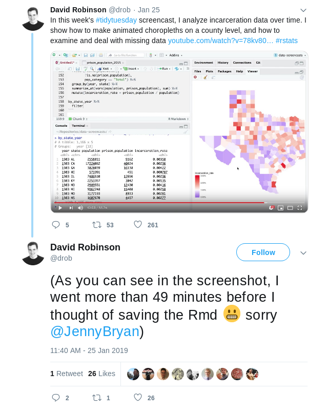

# repromonkey

Repro monkey brings a little chaos to your R session in the name of reproducibility.

Summon the repro monkey to lurk in your workspace. He always asks for
consent first. The easiest way is to add `repromonkey` to your
`.Rprofile` so that you'll always be on your toes when working.

## Installation

You can install the repromonkey from [gadenbuie/repromonkey](https://github.com/gadenbuie/repromonkey) with:

``` r
# install.packages("remotes")
remotes::install_github("gadenbuie/repromonkey")
```

## ⚠️ Warning ⚠️

This is a fun tool to help bolster your confidence as you follow and hone
your reproducibility best practices skills. But it does come at the risk of
data loss and frustration (just like the real world). Your consent is
requested at each R session restart.

## Chaos Monkeys

The repro monkey may (with 10-30 seconds of warning):

- Clear your workspace

- Scramble your global environment (but not functions!)

- Restart your R session

- Stash and close your `Untitled2.R` script somewhere in your project

- Taunt you as you work

## Add to `.Rprofile`

To summon the repro monkey automatically, edit your `.Rprofile` and add
the following lines. (If you use the library `usethis`, you can can call
`usethis::edit_r_profile()`.)

```r
if (interactive() && requireNamespace("repromonkey", quietly = TRUE)) {
 repromonkey::repromonkey()
}
```

If you want to waive the interactive consent, add `consented = TRUE` to the
call to `repromonkey()`.

Note that you can also choose to add **repromonkey** to specific projects
using project-specific `.Rprofile` files.

## Inspiration

Inspired by Netflix's [Chaos Monkey](https://netflix.github.io/chaosmonkey/) and [this screencast by David Robinson](https://www.youtube.com/watch?v=78kv808ZU6o) where he went almost 50 minutes without saving his R script! 😱 


